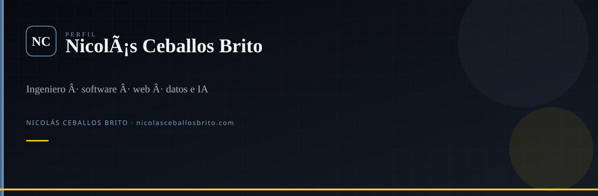

  

 

**Ingeniero en Sistemas y Telecomunicaciones** (UCP 2025)  
Director técnico en [Prosavis](https://www.linkedin.com/in/nicolas-ceballos-brito/) · Pereira, Colombia  
Diseño y construyo productos web, móvil e IA. Disponible para colaboraciones selectas.

---

## Qué construyo

Tres líneas que se leen juntas. El resto del perfil son piezas de aula o producto.

| Línea | Repos | Tesis |
|---|---|---|
| **Salud mental** | [ChatBot-MentalHealth-BERT](https://github.com/Nico2603/ChatBot-MentalHealth-BERT) → [MarIA](https://github.com/Nico2603/MarIA) + [LiveKit Agent](https://github.com/Nico2603/LiveKit_Agent_MarIA) | De un BERT propio a un compañero de voz con GPT, Deepgram y LiveKit |
| **PdM / Industria 4.0** | [Arduino-PdM](https://github.com/Nico2603/Arduino-PdM) → [PdM-Manager](https://github.com/Nico2603/PdM-Manager) · [algoritmos](https://github.com/Nico2603/Algoritmos-de-ML-no-supervisados-para-PdM) · [landing](https://github.com/Nico2603/PdM_Landing-Page) | Sensor → MQTT → clasificación → tablero |
| **Producto vivo** | [nicolas-ceballos-brito](https://github.com/Nico2603/nicolas-ceballos-brito) · [rayito-de-sol](https://github.com/Nico2603/rayito-de-sol) · [lumen-care](https://github.com/Nico2603/lumen-care) | Sitio propio, landing clínica y plataforma de consulta |

Aula y demos: [AI-Lawyer](https://github.com/Nico2603/AI-Lawyer) · [EfficientDet](https://github.com/Nico2603/EfficientDet) · [ATM-Bancolombia](https://github.com/Nico2603/ATM-Bancolombia) · [Colectivo](https://github.com/Nico2603/Colectivo) · [ClinicAI](https://github.com/Nico2603/ClinicAI)

## Stack que uso de verdad

  

Web (React / Next / Vite / Tailwind) · APIs (FastAPI, Node) · datos e IA (PyTorch, TensorFlow, scikit-learn) · móvil (Flutter) · nube (Vercel, Supabase, Firebase cuando el producto lo pide).

## Actividad

  
  

  

## Ahora

- CTO en **Prosavis** (arquitectura, seguridad, producto).
- Sitio: [nicolasceballosbrito.com](https://nicolasceballosbrito.com)
- Hugging Face: [Flackoooo](https://huggingface.co/Flackoooo)

---

**Nicolás Ceballos Brito** · Ingeniero en Sistemas y Telecomunicaciones (UCP 2025)  
CTO · Prosavis · Pereira, Colombia

[nicolasceballosbrito.com](https://nicolasceballosbrito.com)
·
[GitHub](https://github.com/Nico2603)
·
[LinkedIn](https://www.linkedin.com/in/nicolas-ceballos-brito/)
·
[X](https://x.com/NicolasCBrito)
·
[Instagram](https://www.instagram.com/nico_ceballos26/)
·
[Hugging Face](https://huggingface.co/Flackoooo)
·
[Email](mailto:nicolasceballosbrito@gmail.com)

